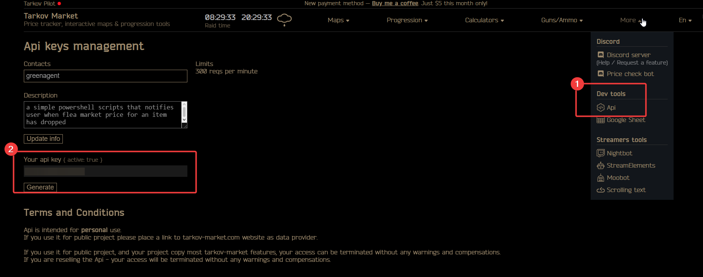
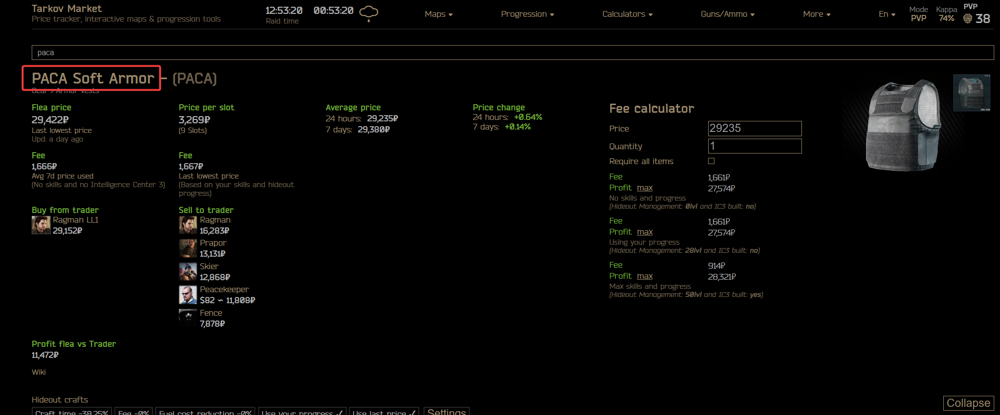

# tarkov-flip-chimer

A PowerShell price-alert tool for Escape from Tarkov's flea market.
It polls prices on a configurable interval and plays a **chime** sound the moment a tracked item hits your buy or sell threshold — so you can flip deals without staring at the screen.

## Features

- **Buy alerts** — chime when a price drops below your target (fixed value or % below average)
- **Sell alerts** — chime when a price spikes above your target
- **Live dashboard** — scrolling console table with current price, target, Diff%, 24h average, and time since last update
- **Duplicate suppression** — the chime fires again only when the price actually changes, not every poll cycle
- **Free mode** — works out of the box via [tarkov.dev](https://tarkov.dev) with no account required

## Requirements

- Windows 10 / 11
- PowerShell 5.1 or later (ships with Windows)
- *(Optional)* A paid API key from [tarkov-market.com/dev/api](https://tarkov-market.com/dev/api) for faster, more reliable data and 7-day averages

## Quick start

1. **Create your config** — copy `config.example.ini` to `config.ini`.

2. *(Optional)* **Add an API key** — subscribe to tarkov-market.com, open the API section, and paste your key into `config.ini`.
   Without a key the tool uses [tarkov.dev](https://tarkov.dev) for free (could be slower and less reliable).
   See [`how-to-get-api-key.png`](how-to-get-api-key.png) for a screenshot.

   

3. **Add items to watch** — one `[Item.<Label>]` section per item.
   Search for the item on [tarkov-market.com](https://tarkov-market.com) and use its name as the `query` value (see [`where-to-get-item-name.png`](where-to-get-item-name.png)):

   

   ```ini
   [Item.PACA]
   query = PACA Soft Armor
   alert = 29000          ; buy when price < 29 000 ₽

   [Item.Bitcoin]
   query     = physical bitcoin
   avgSource = avg24h
   alert     = S7%        ; sell when price > 7% above 24h average
   ```

4. **Run** — double-click `run.bat` (or open a terminal and run `.\Check-TarkovPrices.ps1`).

## Configuration reference

### `[General]`

| Key | Default | Description |
|---|---|---|
| `apiKey` | — | tarkov-market.com API key. Leave blank or as placeholder to use tarkov.dev for free |
| `checkIntervalSecs` | `61` | Seconds between API polls |
| `soundFile` | `alert.wav` | Path to the chime sound (relative to the script folder) |
| `volume` | `5` | Playback volume 0–100 |

### `[Item.<Label>]`

| Key | Default | Description |
|---|---|---|
| `query` | — | Search string sent to the API (**required**) |
| `alert` | — | Alert threshold (**required**) — see format below |
| `avgSource` | `avg7d` | Reference average: `avg7d`, `avg24h`, or a fixed number. In free mode `avg7d` falls back to `avg24h` |
| `used` | `no` | `yes` = track the cheapest (worn) variant; `no` = most expensive (new) |

**Alert format**

| Example | Meaning |
|---|---|
| `15000` | Buy when price < 15 000 ₽ |
| `B15000` | Same as above (explicit buy) |
| `S45000` | Sell when price > 45 000 ₽ |
| `B15%` | Buy when price is more than 15% below `avgSource` |
| `S7%` | Sell when price is more than 7% above `avgSource` |

## Files

| File | Description |
|---|---|
| `Check-TarkovPrices.ps1` | Main monitoring script |
| `run.bat` | Launches the monitor |
| `config.example.ini` | Config template — copy to `config.ini` and edit |
| `chime.wav` | Default alert sound |

## License

MIT
